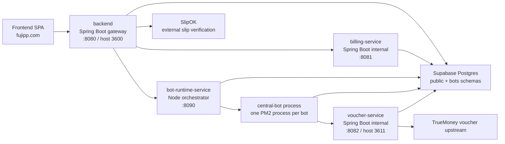

# Backend And Services Architecture

This document maps the backend side of Fujipp's platform: the Spring Boot gateway,
internal billing/voucher services, the runtime orchestrator, and the per-customer
Discord bot process.

Use it before changing backend APIs, shop billing, wallet top-up, runtime slots,
bot startup, or bot feature configuration.

## System Shape

The public frontend should call only the backend gateway (`https://api.fujipp.com`).
Internal services are protected by shared tokens and should not be treated as public
APIs.

## Service Inventory

| Service | Path | Stack | Runs as | Owns |
| --- | --- | --- | --- | --- |
| Main backend | `backend/` | Spring Boot 4, Java 21, Maven, JPA | Docker service `backend`; exposed through nginx as `api.fujipp.com` | Public/admin API facade, auth/profile/project APIs, bot CRUD, runtime/admin routing, wallet/top-up facade, monitoring snapshot. |
| Billing service | `services/billing-service/` | Spring Boot 4, Java 21, Maven, JPA | Docker service `billing`; internal network only | Wallets, payments, catalog/pricing, orders, runtime subscriptions, feature subscriptions, feature config, VPS slot catalog, audit/automation. |
| Voucher service | `services/voucher-service/` | Spring Boot 4, Java 21, Maven, JPA | Docker service `voucher`; internal URL `http://voucher:8082`, host loopback `127.0.0.1:3611` | TrueMoney gift voucher redeem, redeem history, bot-client validation. |
| Runtime orchestrator | `services/bot-runtime-service/` | Node CommonJS, Express, pg, PM2 | Docker service `runtime`; loopback `127.0.0.1:8090` | Reads bot + entitlement config, decrypts bot secrets, composes env, starts/stops one `central-bot` process per subject. |
| Central bot | `services/central-bot/` | Node CommonJS, Discord.js, pg | PM2 child process inside runtime container | Actual Discord bot feature code; loaded per customer bot from env. |

## Main Backend

The main backend is the public API gateway and product coordinator.

| Package | Responsibility |
| --- | --- |
| `controller/` | Public/admin HTTP API surface. Controllers should stay thin. |
| `service/` | Business rules for projects, profiles, bots, placement, monitoring, admin actions. |
| `repository/` | Focused JPA access for backend-owned models. |
| `model/` | JPA entities aligned with Supabase migrations. Do not expose entities as public DTOs. |
| `dto/` | API request/response contracts. |
| `billing/` | HTTP client and DTOs for billing-service, SlipOK, PromptPay helper code. |
| `runtime/` | Runtime target routing and runtime orchestrator client. |
| `security/` | Secret encryption/decryption support. |
| `config/` | Security and app configuration. |
| `automation/` | Runtime renewal/expiry job entrypoint. |
| `discord/` | Discord metadata helper client. |

Important API groups:

| Public/backend route | Controller | What it coordinates |
| --- | --- | --- |
| `/api/auth/**` | `AuthController` | Supabase JWT profile lookup/update. |
| `/api/public/projects/**`, `/api/projects/**` | `ProjectController` | Public project data and admin project edits. |
| `/api/public/health` | `PublicHealthController` | Cached public health snapshot used by `/performance`. |
| `/api/catalog/**` | `CatalogController` | Public feature/runtime plan catalog via billing-service. |
| `/api/orders/**` | `OrderController` | Purchase/order flow via billing-service. |
| `/api/wallet/**` | `TopupController` | Wallet balance, QR top-up creation, SlipOK verification. |
| `/api/bots/**` | `BotController` | Customer bot CRUD, config, slot purchase, start/stop/restart/status. |
| `/api/bots/{botId}/embeds/**` | `BotEmbedController` | Customer-owned bot embed config. |
| `/api/runtime/**` | `RuntimeController` | Runtime store and assignment flow. |
| `/api/subscriptions/**` | `SubscriptionController` | Runtime/feature subscriptions, renewals, auto-renew, feature assignment. |
| `/api/admin/**` | Admin controllers | User, wallet, catalog, bot, subscription, VPS, health, dashboard operations. |

Backend auth is stateless Supabase JWT. Do not add server sessions without a
product-level decision.

## Billing Service

Billing is internal and token-gated. The main backend talks to it with
`X-Service-Token: BILLING_SERVICE_TOKEN`.

| Billing area | Routes | Main model/service files |
| --- | --- | --- |
| Catalog/pricing | `/api/billing/catalog/**`, `/api/billing/admin/catalog/**` | `FeatureCatalog`, `FeaturePrice`, `RuntimePlan`, `BillingCatalogService`, `AdminCatalogService`. |
| Orders/payments | `/api/billing/orders/**`, `/api/payments/**` | `CreditOrder`, `CreditOrderItem`, `Payment`, `OrderService`, `PaymentService`. |
| Wallet | `/api/wallet/**`, `/api/wallet/topup/**`, `/api/billing/admin/wallet/**` | `Wallet`, `WalletTransaction`, `WalletService`, `AdminWalletService`. |
| Bot slots | `/api/billing/bot-slots/**` | `UserBotSlot`, `BotSlotService`. |
| Runtime slots | `/api/billing/runtime/**`, `/api/billing/admin/runtime/**` | `RuntimeSubscription`, `VpsNode`, `VpsSlot`, `RuntimeSlotService`. |
| Feature subscriptions | `/api/billing/subscriptions/**`, `/api/billing/admin/subscriptions/**` | `FeatureSubscription`, `FeatureConfigValue`, `SubscriptionService`, `BotConfigService`. |
| Bot transfer/config | `/api/billing/bots/**`, `/api/billing/admin/bots/**` | `BotRef`, `BotConfigService`, `AdminBotTransferService`. |
| Automation/audit/source | `/api/billing/automation/**`, `/api/billing/admin/audit/**`, `/api/billing/source/**` | `AutomationService`, `AdminAuditService`, `SourceCodeService`. |

Money, subscriptions, renewals, admin grants, and wallet adjustments are
operationally sensitive. Prefer explicit ledger/audit records and reversible
state transitions over hidden side effects.

## Voucher Service

Voucher service redeems TrueMoney gift URLs for customer wallet top-up inside a
running bot.

| Concern | Detail |
| --- | --- |
| Internal endpoint | `POST http://voucher:8082/v1/redeem` inside Backend Platform Docker network. |
| Host compatibility endpoint | `http://127.0.0.1:3611/actuator/health` for host checks; redeem should still be called internally. |
| Auth | `x-api-key: VOUCHER_SERVICE_TOKEN`. |
| Platform client check | `X-Client-Id` must match a real `bots.bot_instances.id` when `VOUCHER_CLIENT_CHECK_ENABLED=true`. |
| Data | `voucher.redeem` and `voucher.phone_summary`. |
| Real/mock upstream | `VOUCHER_ADAPTER=truewallet` for real redeem, `mock` for local/dev. |

The bot-side config should normally leave the TrueMoney base URL blank so the
runtime can inject `VOUCHER_BASE_URL=http://voucher:8082`. The bot's configured
TrueMoney key must match `VOUCHER_SERVICE_TOKEN`.

When debugging a false "voucher invalid/used" error, check in this order:

1. Bot config has the correct TrueMoney phone and key.
2. Runtime env injects `TRUEMONEY_BASE` from `VOUCHER_BASE_URL` or the bot's override.
3. Central bot sends `X-Client-Id` as the subject id.
4. Voucher service accepts that client id and reaches TrueMoney.
5. Redeem history in `voucher.redeem` shows the actual upstream result.

## Runtime Orchestrator

The runtime service is an internal process manager for customer bots.

| Endpoint | Purpose |
| --- | --- |
| `GET /healthz` | Public liveness check. |
| `POST /bots/:id/start` | Build env and start one PM2 bot process. |
| `POST /bots/:id/stop` | Stop/remove the process. |
| `POST /bots/:id/restart` | Rebuild env and restart. |
| `GET /bots/:id/status` | PM2 state for the subject. |

All `/bots/**` routes require `X-Service-Token: RUNTIME_SERVICE_TOKEN`.

Startup rules:

- Subject must exist in `bots.bot_instances`.
- Runtime subscription must be active.
- Discord token must exist and decrypt successfully.
- At least one feature subscription must be active.
- Env is built from bot identity, decrypted secrets, enabled features, feature config values, and platform defaults.

Resume-on-boot:

- `RESUME_ON_BOOT=true` restores DB `RUNNING` bots after container restart.
- `RUNTIME_NODE_ID` scopes restore to this VPS node; this matters when multiple runtime hosts exist.
- `RESUME_STAGGER_MS` spaces out starts.
- `RUNTIME_CONFIG_CACHE_TTL_MS` reduces database round trips for config loading.

## Central Bot

`central-bot` is one configurable Discord bot codebase. The runtime orchestrator
runs one process per customer subject, so each customer still gets their own
Discord application/token.

Current feature registry lives in `services/central-bot/src/features/index.js`.

| Feature code | Area |
| --- | --- |
| `wallet-topup` | PromptPay/SlipOK and TrueMoney top-up commands and handlers. |
| `wallet-history` | Wallet history and balance tools. |
| `roblox-robux-payout` | Roblox shop/payout flow. |
| `top-spender-rank` | Top-up leaderboard and reward roles. |
| `review-credit` | Review counting and reward flow. |
| `voice-keeper` | 24/7 voice presence. |
| `shop-status` | Shop status announcements/channel naming. |
| `server-log` | Server activity logging. |
| `price-board` | Price board embed/menu surface. |
| `order-management` | Order logging/counters. |
| `member-spending` | Member spending tracking. |
| `admin-message-tools` | Admin message utilities. |
| `runtime-expiry-alert` | Per-bot Runtime expiry alerts with selectable milestones and Discord destinations. |
| `bot-presence` | Bot presence/activity loop. |

Feature config keys mirror `billing.feature_variable_templates`. If a new
feature needs customer-editable config, add the bot feature module and seed the
catalog/config metadata through a database migration.

## Critical Flow Maps

### Buying a feature or runtime

1. Frontend calls the backend (`/api/orders`, `/api/runtime`, or `/api/subscriptions`).
2. Backend validates the Supabase JWT and calls billing-service with its service token.
3. Billing-service creates/updates orders, payments, subscriptions, feature config, and wallet ledger state.
4. Backend may ask runtime to restart affected online bots so `ENABLED_FEATURES` and config refresh.

### Starting a bot

1. Frontend/admin calls backend start endpoint.
2. Backend checks ownership/admin access and placement.
3. Backend calls runtime `POST /bots/:subjectId/start` with `RUNTIME_SERVICE_TOKEN`.
4. Runtime reads bot identity, runtime entitlement, feature subscriptions, feature config values.
5. Runtime decrypts secrets with `BOT_SECRET_KEY`, builds env, and starts `central-bot` through PM2.
6. Central bot logs into Discord and loads only enabled features.

### TrueMoney top-up from Discord

1. Customer runs the bot's wallet top-up feature.
2. Central bot calls voucher-service with `x-api-key`, `X-Client-Id`, phone, gift URL, and idempotency key.
3. Voucher-service validates token/client id, redeems through TrueMoney, and records the attempt.
4. Central bot reports success/failure to Discord and updates wallet-side behavior through the configured feature flow.

### Slip/PromptPay top-up from web

1. Frontend calls backend wallet top-up endpoints.
2. Backend creates a billing top-up/payment and returns PromptPay QR metadata.
3. User uploads slip.
4. Backend verifies with SlipOK, then confirms payment in billing-service.
5. Billing-service credits wallet ledger.

## Environment And Secrets

Keep real values only in local `.env` files, GitHub secrets, or `/opt/fujipp/env/platform.env`.

| Env | Used by | Why it matters |
| --- | --- | --- |
| `DB_URL`, `DB_USERNAME`, `DB_PASSWORD` | backend, billing, voucher, runtime, bot | Shared Supabase Postgres connection. Use transaction pooler with `sslmode=require&prepareThreshold=0` where JDBC is used. |
| `SUPABASE_URL`, `SUPABASE_JWT_SECRET` | backend | JWT verification and profile fallback. |
| `BILLING_SERVICE_TOKEN` | backend, billing | Protects billing-service internal APIs. |
| `RUNTIME_SERVICE_TOKEN` / `SERVICE_TOKEN` | backend, runtime | Protects runtime orchestrator APIs. |
| `VOUCHER_SERVICE_TOKEN` | voucher, runtime/bot config | Protects TrueMoney redeem. |
| `BOT_SECRET_KEY` | backend, billing, runtime | AES-GCM secret encryption/decryption; must match everywhere. |
| `RUNTIME_NODE_ID` | runtime | Limits resume-on-boot to this VPS node. |
| `RESUME_ON_BOOT` | runtime | Restores RUNNING bots after deploy/restart. |
| `VOUCHER_BASE_URL` | runtime | Default internal voucher endpoint injected into bot env. |
| `SLIPOK_*`, `PROMPTPAY_ID` | backend | Web wallet top-up QR and slip verification. |
| `MONITORING_*` | backend | Public/admin health collection; DB writes/probes should stay opt-in. |

## Database And Pooler Notes

- Spring services use JPA with `ddl-auto=validate`; schema changes belong in Supabase migrations.
- Production JDBC should use the Supabase transaction pooler on port `6543` with `prepareThreshold=0`.
- Keep Hikari pools small (`maximum-pool-size` usually 2-3 for services on the current VPS).
- Runtime and bot Node services use `pg`; keep their pool usage conservative because they share the same Supabase project.
- Do not apply production migrations from `main`; stage database changes on `db/migrations` and apply manually.

## Debug Starting Points

| Symptom | Start here |
| --- | --- |
| Frontend API fails | backend logs, nginx/API health, `API_BASE_URL`, CORS. |
| Wallet balance/order wrong | billing-service logs, wallet/payment/order models, backend `BillingClient`. |
| Slip top-up fails | backend `TopupService`, SlipOK env, billing payment confirmation. |
| TrueMoney top-up says invalid/used | central-bot wallet feature config, runtime injected env, voucher logs/redeem table. |
| Bot will not start | backend `BotRuntimeOps`, runtime logs, `buildEnv` errors, Discord token, active runtime/features. |
| Bot did not return after deploy | runtime `RESUME_ON_BOOT`, `RUNTIME_NODE_ID`, PM2 status, runtime logs. |
| VPS slot count looks wrong | billing `VpsNode`/`VpsSlot`, backend/admin VPS controllers, runtime subscriptions. |
| Supabase egress/pool spikes | performance page polling, monitoring flags, runtime config cache, pool sizes. |

## Verification Rule

Do not run Maven tests/builds, Node service starts, browser checks, or live database
commands unless the task explicitly asks for verification. Most backend/service
commands can consume real Supabase pooler slots or touch live-style config.
