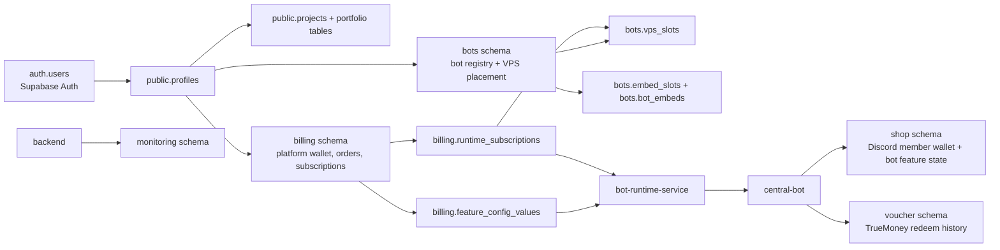
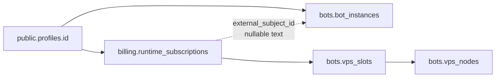
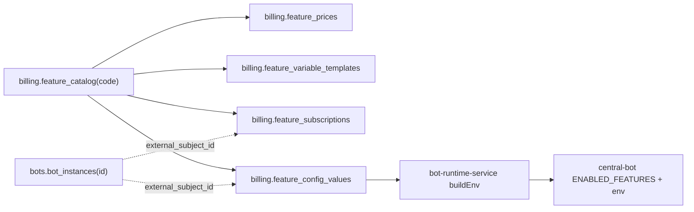

# Database And Supabase Architecture

This document maps Fujipp's Supabase/Postgres schema as it exists in
`supabase/migrations/`. Use it before changing wallet, bots, subscriptions,
runtime slots, feature config, embeds, monitoring, or Supabase auth/profile logic.

This is a source map, not a production migration procedure. Production schema
changes are staged on `db/migrations` and applied manually.

## System Shape

## Schema Inventory

| Schema | Purpose | Main writers/readers | Exposure model |
| --- | --- | --- | --- |
| `public` | Supabase profile extension and portfolio/project content. | Frontend via Supabase for auth/profile fallback; backend for profiles/projects. | Some tables have authenticated/public RLS policies; project assets are public-read. |
| `billing` | Platform commerce: Fujipp customer wallet, payments, catalog, orders, subscriptions, runtime plans, feature config, audit/automation. | `billing-service`, backend gateway. | Internal service-role only; RLS enabled as defense in depth. |
| `bots` | Customer bot registry, encrypted Discord credentials, VPS nodes/slots, bot ownership slots, embed templates/overrides. | Backend, runtime orchestrator, billing-service for slot counters. | Internal service-role only; RLS enabled as defense in depth. |
| `shop` | Per-Discord-shop data used by central-bot: member wallet, Robux panels, review credit, order counters, member spending, shop status messages. | `central-bot` through `pg`. | Internal service-role only; Discord members are not Supabase users. |
| `voucher` | TrueMoney voucher redeem attempts and phone summary view. | `voucher-service`. | Internal service-role only; no raw gift URL stored. |
| `monitoring` | Optional historical metrics and incident storage for platform health. | Backend `HealthMonitorService`. | Not exposed through Supabase API; public data goes through backend endpoints. |

## Core Tables By Domain

### Identity And Portfolio (`public`)

| Table/function | Purpose |
| --- | --- |
| `public.profiles` | One row per `auth.users` account; owns role, display name, avatar, website/GitHub metadata. |
| `public.handle_new_user()` | Trigger creates a profile on Supabase auth signup. |
| `public.is_username_available(text)` | RPC used by auth UI before registration. |
| `public.set_updated_at()` | Shared trigger function reused by many schemas. |
| `public.projects` | Portfolio project root record. |
| `public.project_features`, `project_learnings`, `project_tech_stack` | Portfolio detail sections. |
| `public.project_translations`, `project_feature_translations`, `project_learning_translations` | Localized project copy. |
| `public.project_gallery`, `project_links`, `project_roles`, `project_timeline_milestones`, `project_challenge_translations` | Later portfolio detail expansions. |

`public.profiles.role` is the admin/user boundary used by backend/admin APIs. Do
not authorize privileged behavior from user-editable metadata.

### Platform Billing (`billing`)

| Table | Purpose |
| --- | --- |
| `wallets` | Fujipp customer wallet balance. This is how customers pay for bot services. |
| `wallet_transactions` | Platform wallet ledger. Keep it append-only in spirit; adjustments should leave traceable rows. |
| `payments` | Real money in for web top-up. Slip/PromptPay confirmation credits `wallets`. |
| `feature_catalog` | Sellable bot features/add-ons by stable `code`. |
| `feature_prices` | Price SKUs for each feature: monthly rent, permanent rent, source code. |
| `runtime_plans` | Hosting time packages. |
| `feature_variable_templates` | Config schema shown in the frontend bot config UI and injected into bot env. |
| `feature_subscriptions` | Owned features. `BOT` scope targets one bot; `ACCOUNT` scope applies across the user's bots. |
| `runtime_subscriptions` | Paid hosting runtime. May be unassigned, assigned to one bot, and parked on one VPS slot. |
| `feature_config_values` | Per-bot config values; secrets are encrypted by app code before storage. |
| `credit_orders`, `credit_order_items` | Wallet-spend receipts for purchases. |
| `source_code_entitlements`, `source_code_releases` | Source-code purchase/download model. |
| `customer_notifications` | Billing/runtime notification queue. |
| `automation_settings`, `automation_runs` | Operational settings and history for renewal/expiry automation. |
| `admin_audit_log` | Admin action audit history. |

Money is stored in satang (`BIGINT`), not baht decimals.

### Bots And Runtime Placement (`bots`)

| Table | Purpose |
| --- | --- |
| `bot_instances` | One customer bot subject. Its `id` is the `external_subject_id` used by billing and runtime. |
| `vps_nodes` | Runtime host inventory. Future VPS nodes live here. |
| `vps_slots` | Addressable hosting seats under a node. Occupancy is derived from active runtime subscriptions. |
| `user_bot_slots` | Paid permanent bot ownership slots beyond the free allowance. |
| `embed_slots` | Feature/embed slot registry and default JSON templates. |
| `bot_embeds` | Per-bot embed overrides. |

Secrets in this schema are encrypted application-side with `BOT_SECRET_KEY`, using
the same envelope style described in the bot registry migration. The DB stores
ciphertext only.

### Bot Feature Runtime Data (`shop`)

| Table | Purpose |
| --- | --- |
| `member_wallets` | Discord member wallet balance for one customer bot/shop. This is separate from `billing.wallets`. |
| `wallet_ledger` | Ledger for the in-bot Discord member wallet. |
| `review_credit_state` | Review credit feature progress/state. |
| `roblox_panels` | Live Roblox panel state so panels survive bot restart. |
| `order_counters` | Order counter storage for order-management feature. |
| `member_spending` | Manual membership/spending tracker. |
| `shop_status_messages` | Shop status message/channel state. |

Important distinction:

- `billing.wallets` = Fujipp customer's platform balance used to buy runtime/features.
- `shop.member_wallets` = Discord member balance inside a customer's shop bot.

### Voucher (`voucher`)

| Table/view | Purpose |
| --- | --- |
| `voucher.redeem` | TrueMoney redeem attempts, status, amount, phone, upstream reference, failure detail, idempotency key. |
| `voucher.phone_summary` | Aggregate successful top-ups by phone. |

The gift URL is stored as `gift_url_hash`, not raw URL.

### Monitoring (`monitoring`)

| Table | Purpose |
| --- | --- |
| `metric_snapshots` | Optional historical CPU/RAM/disk/network/latency samples. |
| `incidents` | Optional incident open/resolve history. |

Production currently prefers lightweight cached health responses and keeps DB
monitoring writes/probes opt-in to reduce Supabase usage.

## Runtime Slot Model

Rules:

- A bot is owned by a profile: `bots.bot_instances.user_id`.
- A runtime subscription is paid hosting owned by the same profile.
- `runtime_subscriptions.external_subject_id` links runtime to a bot when assigned.
- `runtime_subscriptions.vps_slot_id` links runtime to one seat.
- Active runtime uniqueness is enforced by partial indexes: one active runtime per bot and one active runtime per slot.
- `vps_slots.status` describes seat availability/reservation/maintenance; actual occupancy is derived from active runtime subscriptions.
- `RUNTIME_NODE_ID` on each runtime host should match the node registered in `bots.vps_nodes` so resume-on-boot restores only that host's bots.

## Feature And Config Model

Current seeded feature codes include:

| Feature code | Area |
| --- | --- |
| `roblox-robux-payout` | Roblox shop/payout flow. |
| `wallet-topup` | Discord wallet top-up with PromptPay/SlipOK and TrueMoney. |
| `wallet-history` | Wallet history/admin balance tools. |
| `top-spender-rank` | Top-up leaderboard and reward roles. |
| `review-credit` | Review counter/reward feature. |
| `voice-keeper` | 24/7 voice presence. |
| `server-log` | Server activity logging. |
| `price-board` | Price board embed/menu feature. |
| `bot-presence` | Bot presence/activity. |
| `order-management` | Order logging/counters. |
| `member-spending` | Manual spending/membership card feature. |
| `admin-message-tools` | Admin DM/message utilities. |
| `runtime-monitor` | Runtime status command. |
| `shop-status` | Shop open/closed/busy announcements. |

If a new central-bot feature needs UI config:

1. Add/modify the central-bot feature module.
2. Add a migration that seeds `feature_catalog`, `feature_prices`, and `feature_variable_templates`.
3. Add embed slots in `bots.embed_slots` if the feature has editable Discord embeds.
4. Make sure runtime `buildEnv` will receive every needed config key through `feature_config_values`.

## Wallet Flow Map

### Platform wallet, used to buy Fujipp services

1. User creates a top-up/payment through backend.
2. Backend verifies payment/slip and asks billing-service to confirm.
3. Billing-service credits `billing.wallets` and writes `billing.wallet_transactions`.
4. Purchases write `billing.credit_orders` / `billing.credit_order_items`.
5. Successful purchases create or update `feature_subscriptions`, `runtime_subscriptions`, bot slots, or source entitlements.

### In-bot member wallet, used by Discord shop members

1. Central bot receives top-up/redeem action in Discord.
2. TrueMoney path calls voucher-service and records `voucher.redeem`.
3. PromptPay/SlipOK path uses wallet-topup feature handlers.
4. Central bot credits `shop.member_wallets` and writes `shop.wallet_ledger`.
5. Roblox/other purchase features debit the same `shop.member_wallets`.

Never mix the two wallet layers. They serve different users and different
business flows.

## RLS And Access Model

| Area | Intended access |
| --- | --- |
| `public.profiles` | Authenticated users can read/update themselves; service role can manage all. |
| Portfolio public tables/assets | Public read for published content; admin writes go through backend/service role. |
| `billing`, `bots`, `shop`, `voucher`, `monitoring` | Service-role/internal application access only; RLS enabled as defense in depth. |

Security notes:

- Do not expose service-role keys to browser code.
- Do not add `anon`/`authenticated` grants to internal schemas just to make frontend queries work; route through backend instead.
- Views that become public must be reviewed for RLS behavior.
- Avoid new `SECURITY DEFINER` functions unless the ownership and execute grants are deliberate.

## Migration Workflow

Production migrations are not auto-applied from `main`; Supabase watches
`db/migrations` and applies reviewed migrations automatically after they are pushed.

1. Start from the persistent `db/migrations` branch for real schema work.
2. Create a migration with `supabase migration new <name>`.
3. Keep one schema/product change per migration.
4. Never edit or delete a migration that has been applied or pushed.
5. Include constraints, indexes, RLS, grants, policies, and backfills in the migration when needed.
6. Update matching backend/service JPA entities or SQL queries in the same work.
7. Push the reviewed migration commit to `db/migrations` to trigger the automatic Supabase migration.

`main` is the repository history/source-of-truth, but it is not the production
apply mechanism; `db/migrations` is.

## Debug Starting Points

| Symptom | Start here |
| --- | --- |
| Login/profile issue | `public.profiles`, `handle_new_user`, profile RLS, backend `Profile`/`AuthController`. |
| Frontend project content wrong | `public.projects` and related project tables, public RLS, backend `Project` mapping. |
| Web wallet balance/order wrong | `billing.wallets`, `wallet_transactions`, `payments`, `credit_orders`, billing-service logs. |
| Runtime slot count wrong | `bots.vps_nodes`, `bots.vps_slots`, active `billing.runtime_subscriptions`. |
| Bot does not start | `bots.bot_instances`, `runtime_subscriptions`, `feature_subscriptions`, `feature_config_values`. |
| Bot config missing in runtime | `billing.feature_variable_templates` and `feature_config_values` for that `external_subject_id`. |
| Editable embed not showing | `bots.embed_slots` default and `bots.bot_embeds` override for the bot. |
| TrueMoney top-up issue | `voucher.redeem`, bot config values for `TRUEMONEY_*`, voucher-service logs. |
| Discord member wallet issue | `shop.member_wallets`, `shop.wallet_ledger`, central-bot wallet feature logs. |
| Performance page creates DB usage | Backend monitoring flags; `monitoring.*` should stay opt-in for persistence/probes. |

## Related Docs

- Migration rules: `supabase/README.md`
- Backend/services flow: `docs/operations/backend-services.md`
- Backend rules: `.agents/scopes/backend.md`
- Database rules: `.agents/scopes/database.md`
